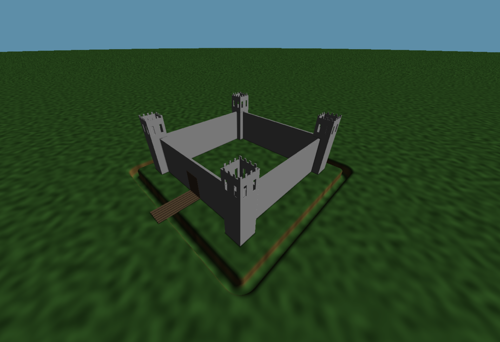

# CIS 566 Homework 2: Raymarching SDFs

## Overview

Matthew Riley\
PennKey: matriley\
Live at: https://mgriley.github.io/hw02-/

## Description:

The terrain is generated in several stages. Each stage takes a StageState struct (containing height, color, normal, etc.) from the previous stage as input, modifies it, then passes it on to the next stage. This allows subsequent stages to adapt to changes made in earlier stages. There are currently only two stages. The first stage generates the height-map for the hexagon spires. It translates the plane position into a 2d space tightly tiled by hexagons, finds the center of the nearest hexagon, and then uses a 2d sdf to detect if the point is contained in the hexagon. The height and frequency of the hexagonal tiles is informed by a smooth 2d noise function. 

The second stage sets the height of the wave-like substance. It first reads the height from the StageState structure. If it is 0, we know that no hexagonal tile was drawn in the hexagon stage, so we set the height without overriding the geometry of any tiles. I used surface-let based 2d noise to set the height. That is, the height is the distance-weighted average of the 3d position of a 2d plane point projected on several different slopes/hills, where each "hill" is determined by a 2d vector (giving the hill's gradient) at a certain grid point.  

The sky uses the same surface-let noise as stage 2, with a simple animation to pan the clouds across the horizon.

## Stage 1 - Hexagonal Tiles

## Stage 2 - Slopes

## Sources

I referred to the following articles on Inigo Quilez's website:
http://iquilezles.org/www/articles/distfunctions2d/distfunctions2d.htm
http://iquilezles.org/www/articles/functions/functions.htm

